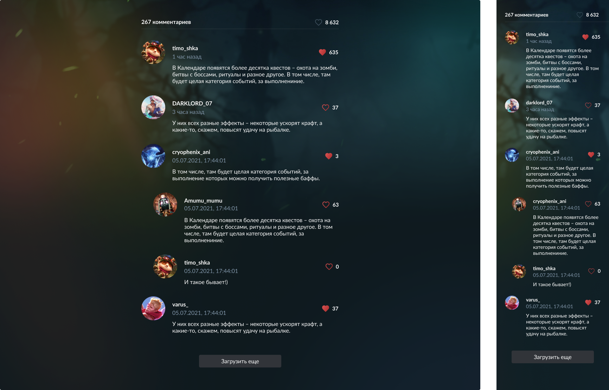

# Тестовое задание

1. Репозиторий не форкать
2. Выполненное задание загрузить на GitHub (GitHub Pages)

## Задачи:

1. Вывести на экран комментарии, соблюдая их вложенность и пагинацию, используя запросы из `src/api`
2. Обработать успех/ошибку/загрузку каждого запроса
3. Динамически считать сумму лайков и комментариев
4. Добавить возможность ставить и убирать лайк у комментария

## Нельзя:

1. Модифицировать папку `src/api`
2. Менять содержимое возвращаемых данных в `src/data`
3. Читать данные напрямую из `src/data`, минуя запросы
4. В `src/index.tsx` выключать StrictMode, убирать вызов useMockAdapter

Что не запрещено - то разрешено

## Дизайн:

### Figma [Comments.fig](Comments.fig)

